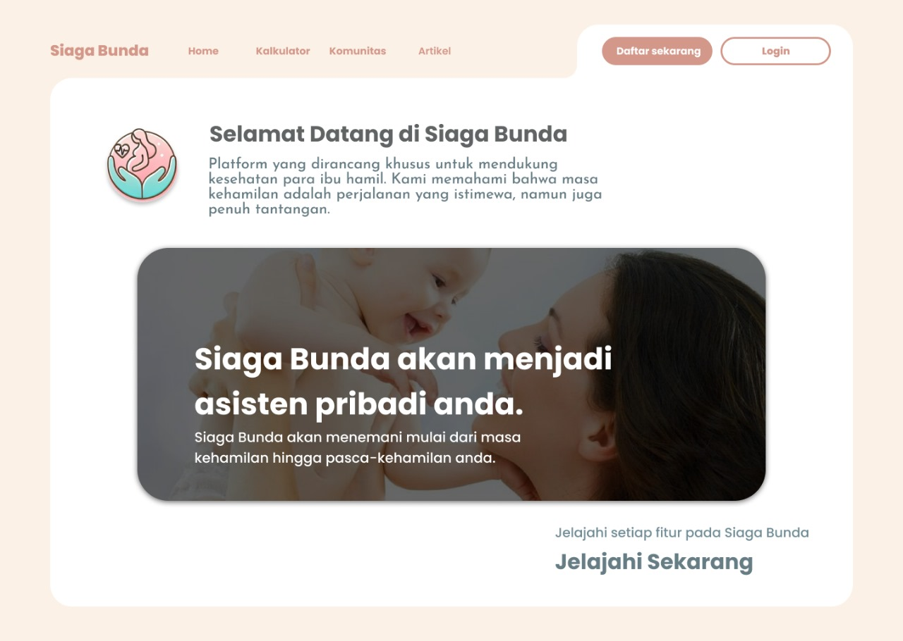
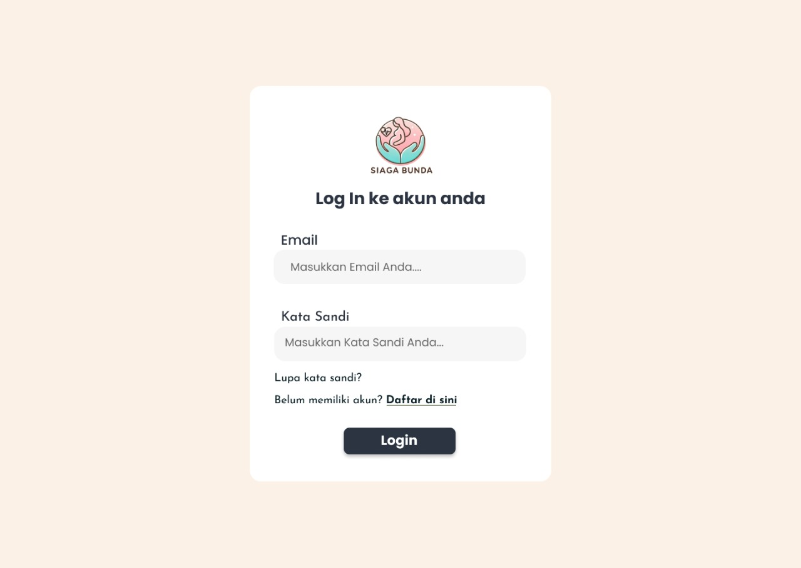
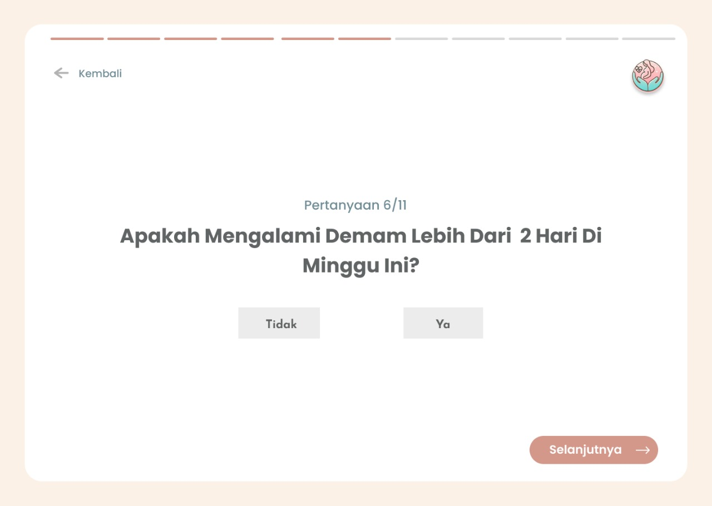
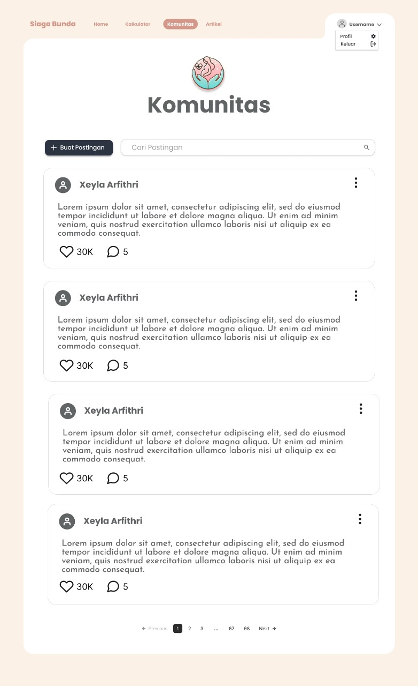
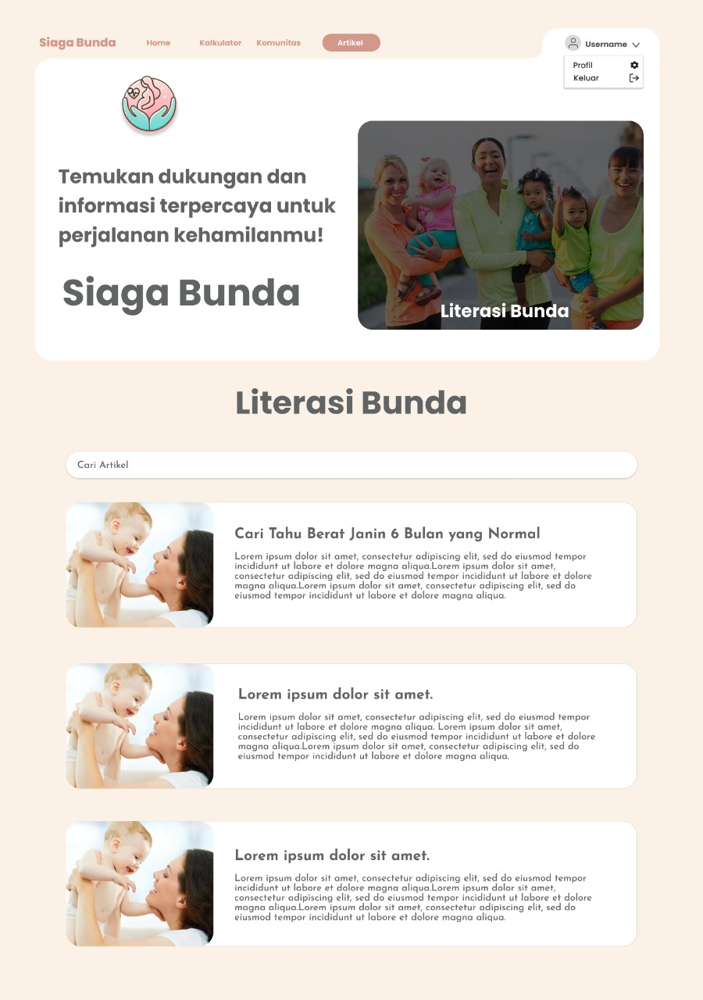
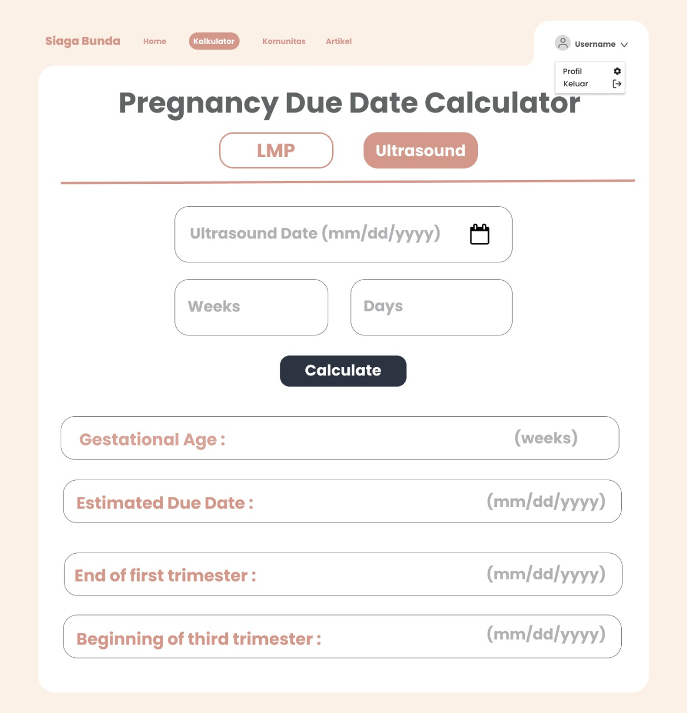

# Siaga Bunda - Aplikasi Kesehatan ibu hamil

## Description
Aplikasi berbasis online yang dirancang untuk mendukung kesehatan ibu
hamil dengan menyediakan berbagai fitur, seperti pencatatan kesehatan, skrining, kalkulator
kehamilan, artikel edukatif, dan forum komunitas. Aplikasi ini membantu ibu hamil
memantau kondisi kesehatan dan mendapatkan informasi yang relevan selama kehamilan.

## Screenshot

<table>
  <tr>
    <td></td>
    <td></td>
    <td></td>
    <td></td>
  </tr>
  <tr>
    <td></td>
    <td></td>
    <td></td>
    <td></td>
  </tr>
</table>

## Features
- ✅ Tracking kehamilan
- ✅ Skrinning kehamilan
- ✅ Artikel dan edukasi
- ✅ Forum/komunitas
- ✅ Kalkulator kehamilan

## Architecture
- PHP Native
- Javascript
- TailwindCSS
- Oracle SQL

## Figma
https://www.figma.com/design/E18gAeEUKBNt2MoZ8iAB8X/siaga-bunda?node-id=800-165&t=UFL3Z1WPcwGMXdZx-1
